# Shiori Keeper

## Overview

Shiori Keeper is a very simple web app for listing, finding, and organizing bookmarks collected in your browser.  
It is designed to make it easier to revisit links later.

_Shiori(栞)_ means “bookmark” in Japanese.

> [!WARNING]
> This project is still in alpha, so destructive changes to the database may happen.
> If anything goes wrong, please report it with the `bug` label on the issue tracker.

## How to Install

If you use the published image, pull it from GitHub Container Registry and run it locally:

```bash
docker pull ghcr.io/kai17-a/shiori-keeper:latest
docker run --rm -p 3000:3000 -p 8000:8000 \
  -e DATABASE_URL=/data/data.db \
  -v "$(pwd)/data:/data" \
  ghcr.io/kai17-a/shiori-keeper:latest
```

After startup, open the frontend at `http://127.0.0.1:3000` and the API at `http://127.0.0.1:8000`.

If you prefer `docker compose`, use a setup like this:

```yaml
services:
  shiori-keeper:
    container_name: shiori-keeper
    image: ghcr.io/kai17-a/shiori-keeper:latest
    environment:
      DATABASE_URL: /data/data.db
    ports:
      - "3000:3000"
      - "8000:8000"
    volumes:
      - ./data:/data
```

## What You Can Do

### Manage bookmarks in one place

- Register bookmarks with a URL, title, and description
- Edit or delete bookmarks later
- Mark important bookmarks as favorites so they are easier to find

### Organize with folders

- Group bookmarks into folders
- Create, rename, and delete folders
- When a folder is deleted, the bookmarks inside remain and are simply unassigned from that folder

### Classify with tags

- Attach multiple tags to a single bookmark
- Create, rename, and delete tags
- When a tag is deleted, its bookmark links are removed automatically

### Find things quickly

- Search bookmarks by keyword
- Filter by folder or tag
- Browse results with pagination

### Keep RSS feeds separately

- Register RSS or Atom feed URLs
- List, edit, and delete RSS feeds
- Run a feed manually and connect the result to external notifications
- Run RSS feeds periodically with the batch process and send new articles to Discord or Microsoft Teams webhooks

### Configure notifications

- Set a global Discord or Microsoft Teams webhook used across the app
- Test whether the webhook endpoint is reachable
- Use the webhook as the notification target for RSS execution

### See the overall status at a glance

- View counts for bookmarks, folders, tags, favorites, and RSS feeds on the dashboard
- See recent bookmarks and saved folders or tags

### Switch the appearance

- Choose between system, light, and dark themes

## Main Screens

- `Dashboard`: View overall counts and recent bookmarks
- `Bookmarks`: List, search, add, edit, and delete bookmarks
- `Favorites`: View only bookmarked items marked as favorites
- `Folders`: Create, edit, and delete folders
- `Tags`: Create, edit, and delete tags
- `RSS`: Register, edit, delete, and execute RSS feeds, including periodic batch runs
- `Settings`: Configure the theme and webhook

## Where Data Is Stored

- Data is stored in a SQLite database
- Your saved information remains even after you close the browser

## Intended Use

- A bookmark organizer for individuals or small teams
- Helps turn an ever-growing list of saved links into something easier to browse with folders and tags
- Also keeps RSS feeds in the same app

## Browser Extension

- [chrome web store](https://chrome.google.com/webstore/detail/dfjcocpbcdlleogghldbdcapomilohia)

## Notes

- Invalid URL formats cannot be registered
- Duplicate bookmark URLs, tag names, and RSS feed URLs are not allowed
- The webhook system supports Discord and Microsoft Teams incoming webhooks

## Development Notes

- Workflow and commit rules are in [DEVELOPMENT.md](./DEVELOPMENT.md)
- Changelogs stay focused on user-facing changes

## Screenshots

### Light

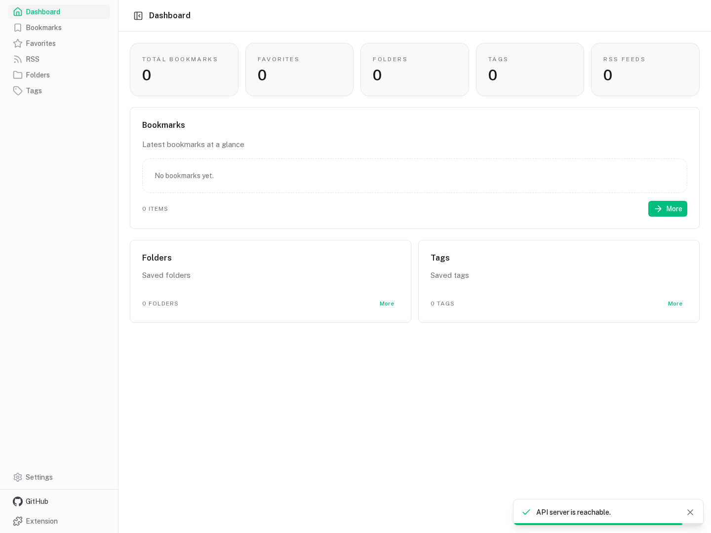
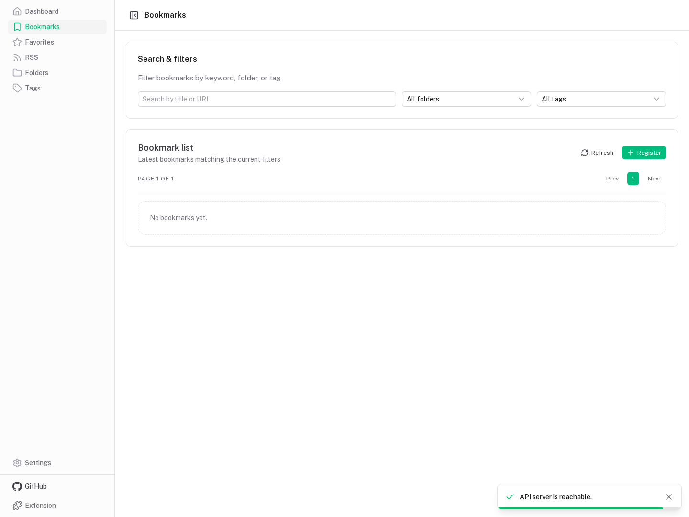
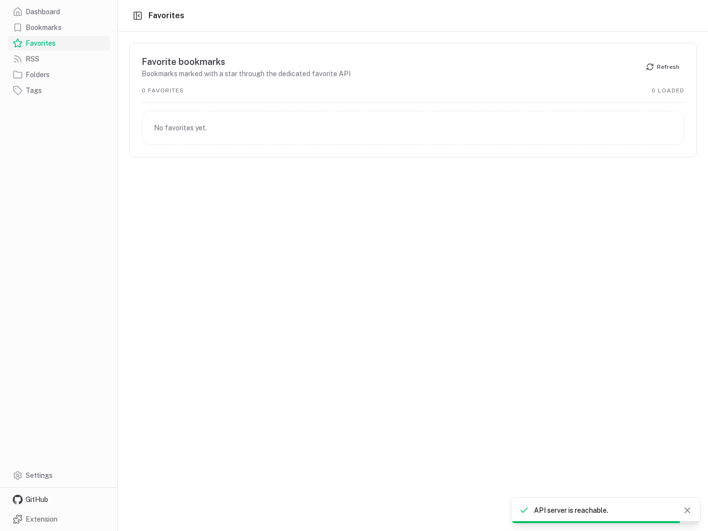
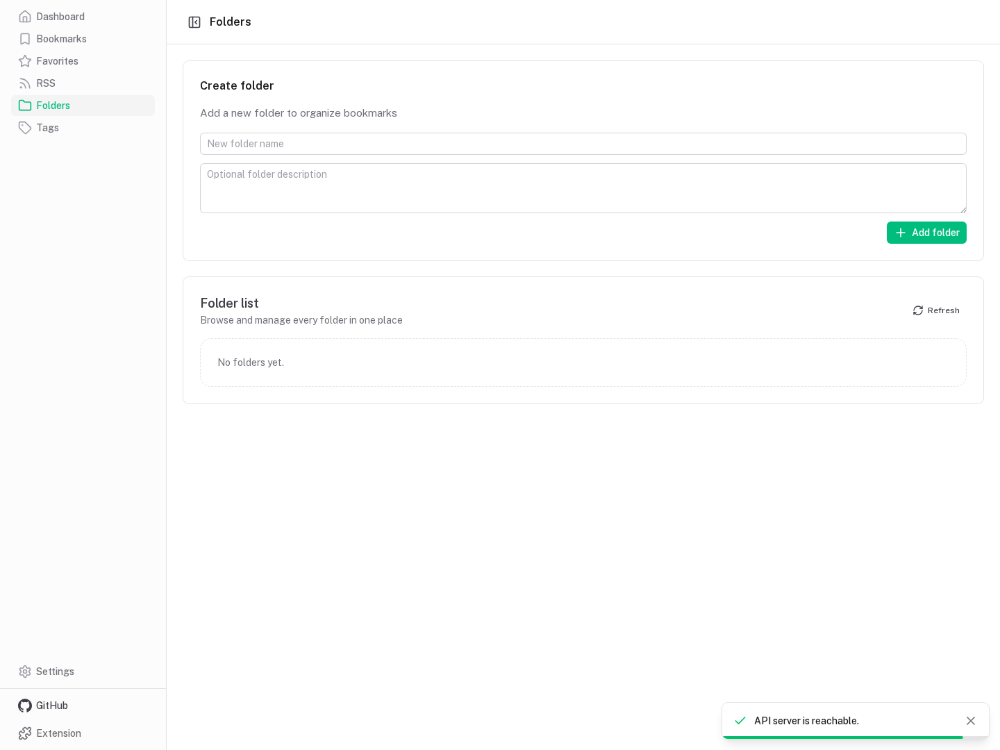
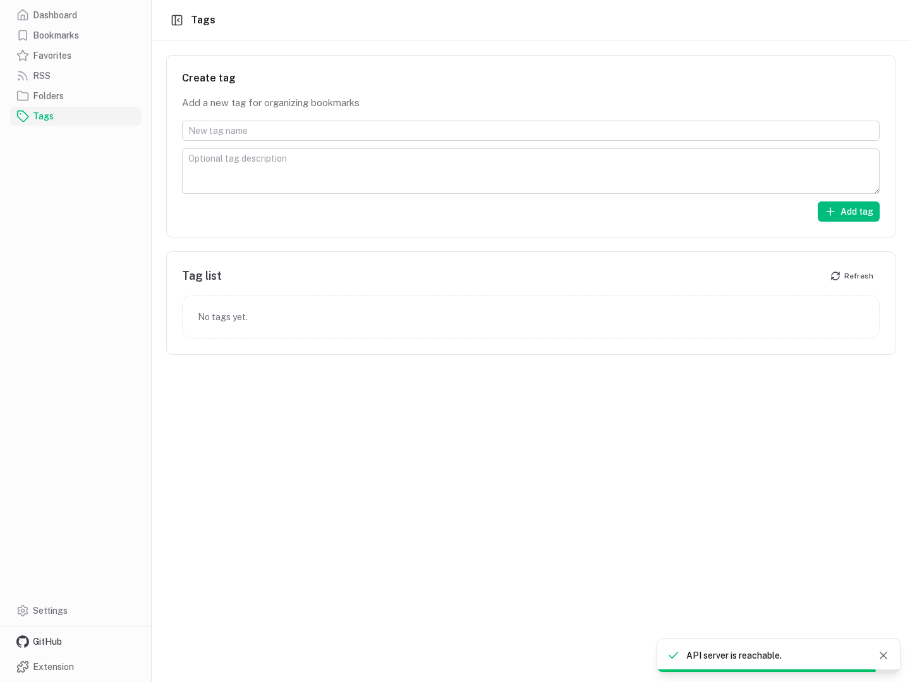
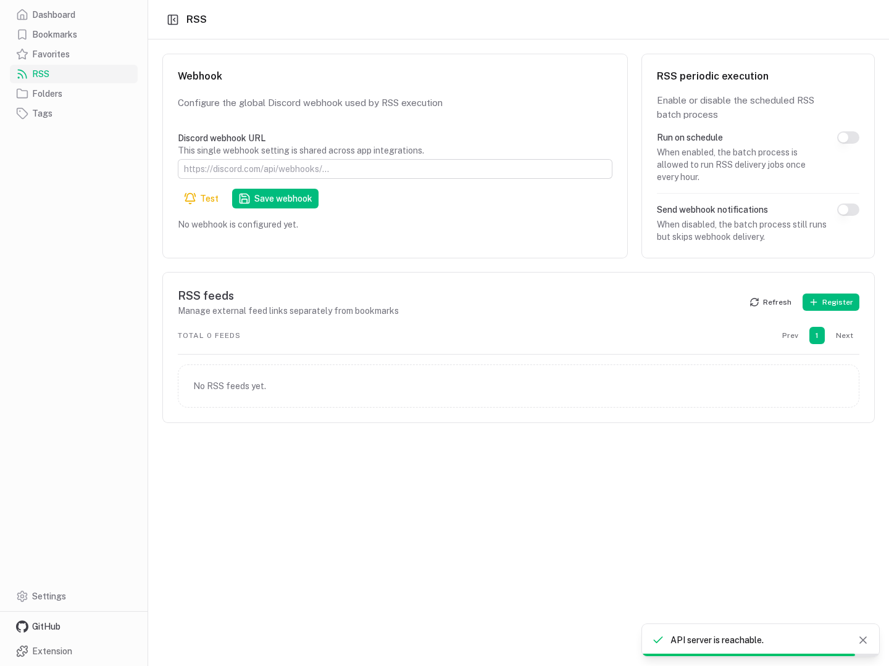
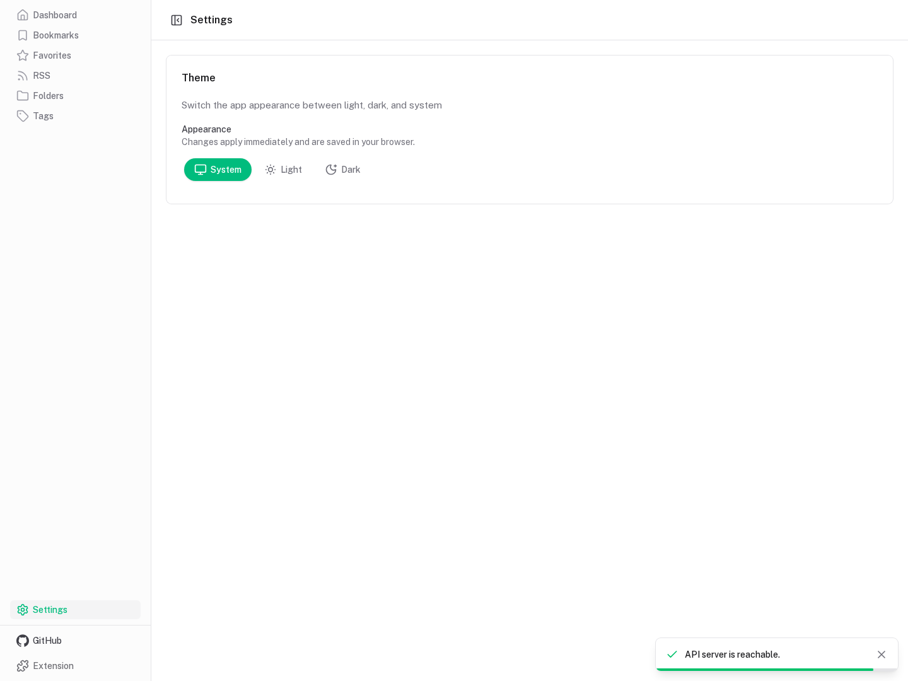

### Dark

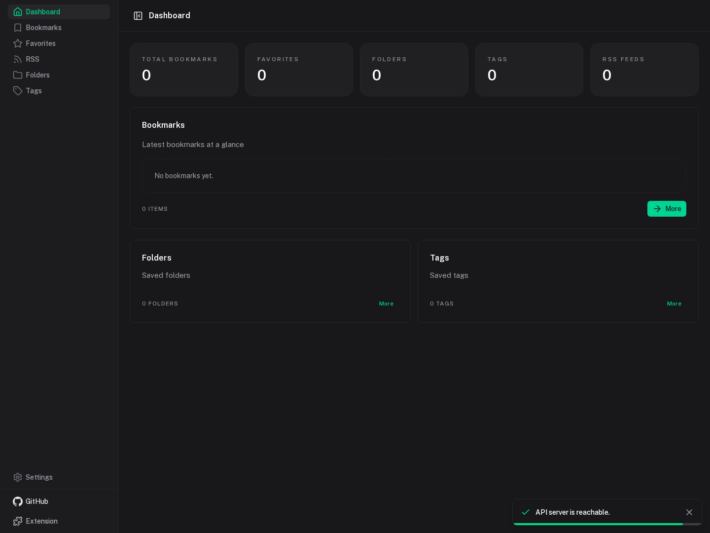
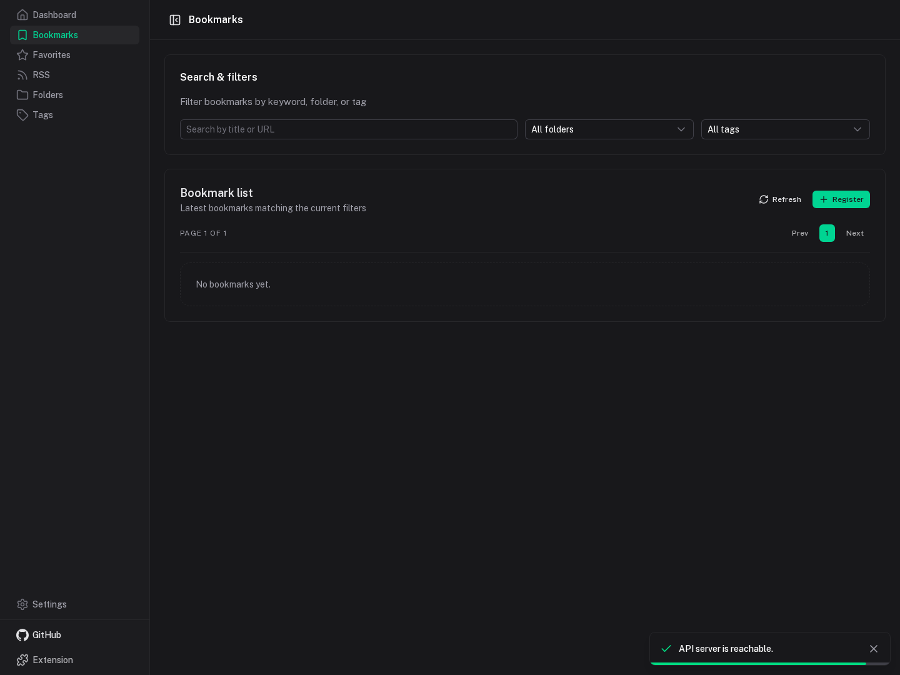
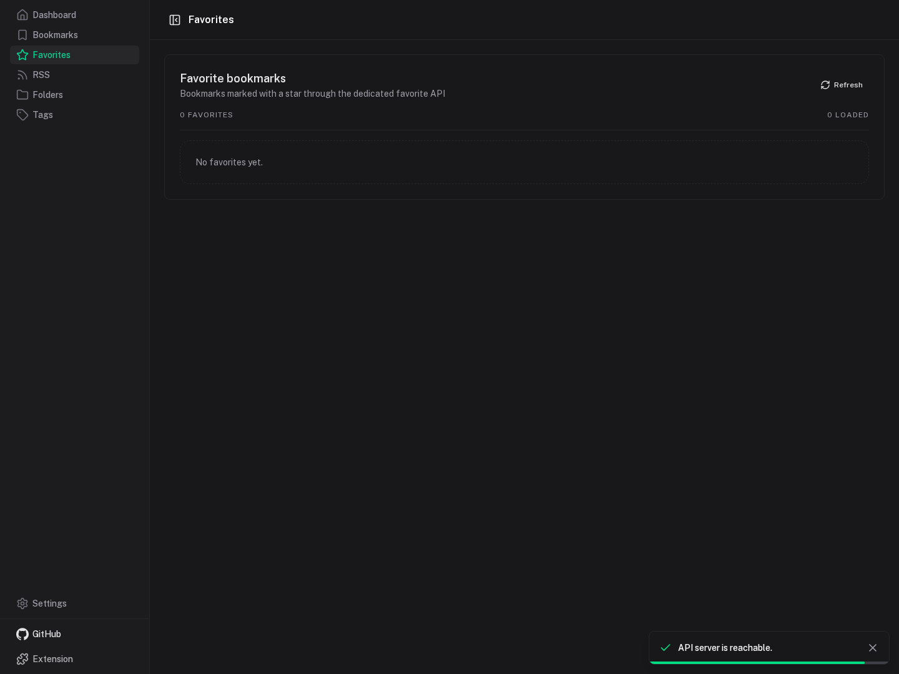
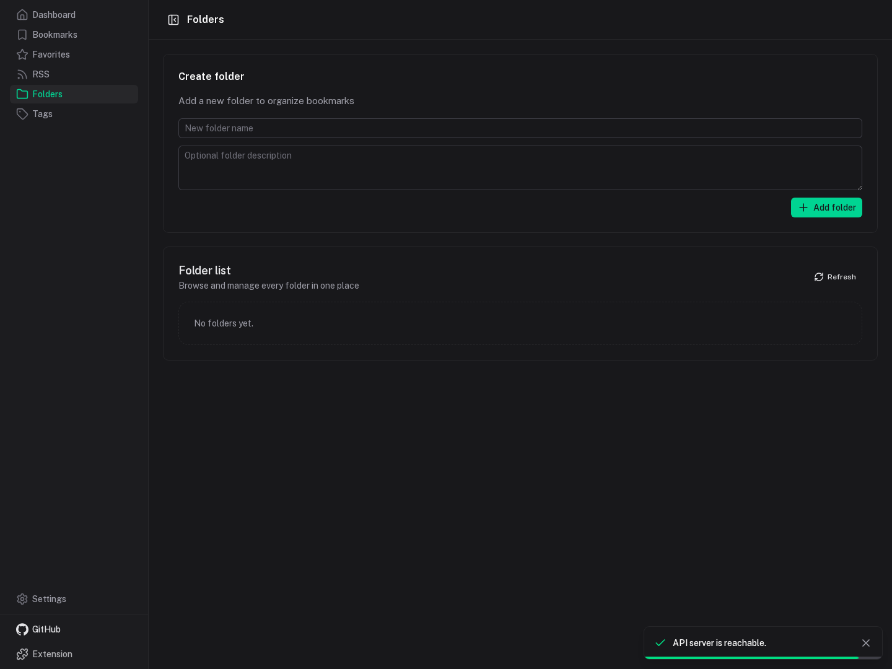
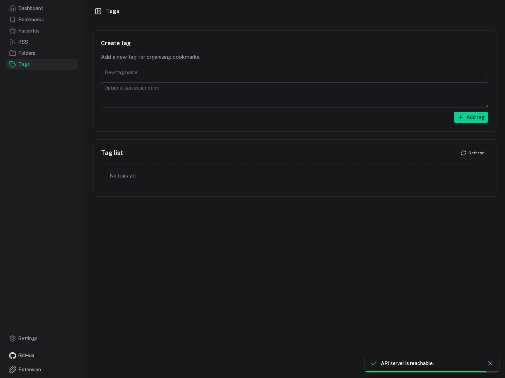
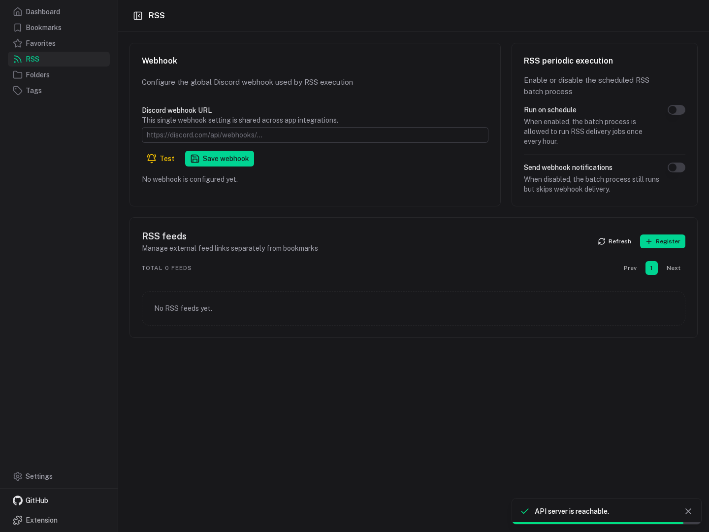
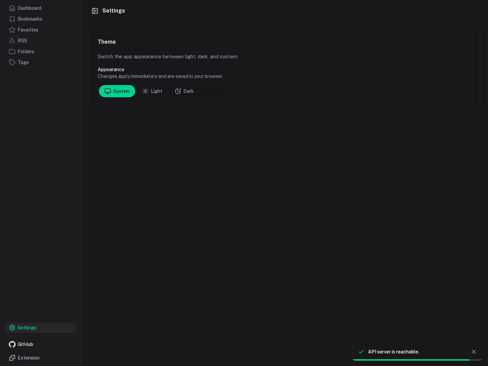
